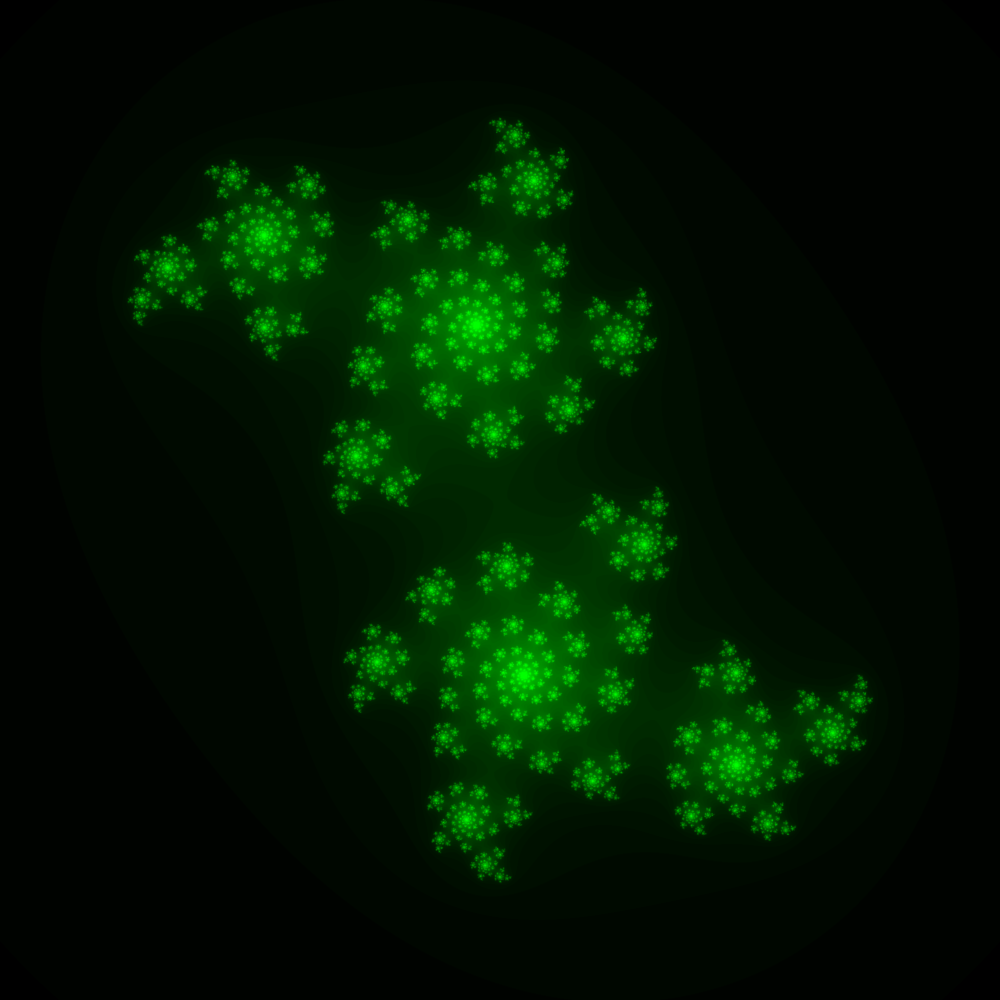

# rust-image-generation

🦀🦀🦀 This is pretty much a log of my Rust-learning journey ! As a beginner rustacean, these are my two first projects : 🦀🦀🦀

## Julia sets :

### Generating representations of Julia sets for a given complex number

Here i used the "image" and "num_complex" crates to create this bin project :

In a bash terminal (w/ julia binary in working directory) usage may look like :

```sh
$ ./julia <real_part> <complex_part> <image_size_in_pixels> <nb_of_shades> <img_name_with_extension>
```

> ex : ./julia 0.2 -0.6 2000 300 julia1.png



> NB: numbers are stored over 32 bits, large numbers may cause unwanted behaviour

> The only format i've tested is png, jpeg should work according to [documentation](https://docs.rs/image/0.23.14/image/struct.ImageBuffer.html#method.save)

### Making Gif files

You can also make a gif from several images automatically with keyword "animate" : doing so creates an animation that starts from the given number and shows Julia sets for a whole rotation around point 0, in as many steps as you like !

```sh
$ ./julia animate <real_part> <complex_part> <image_size_in_pixels> <nb_of_frames>
```


### Faster !

Want to see individual frames of your animation ?
Encoding gifs takes a while with the image crate. A faster alternative is to generate infividual frames with the "frames" keyword :

```sh
$ ./julia animate <real_part> <complex_part> <image_size_in_pixels> <nb_of_frames> <path_to_frames> <format>
```

## Raytracer :

My second rust project was a simple raytracer :
This also uses the image crate, and was built in a Test Driven Development approach, to familiarize with rust's test system.


Thanks for checking out my projects !
